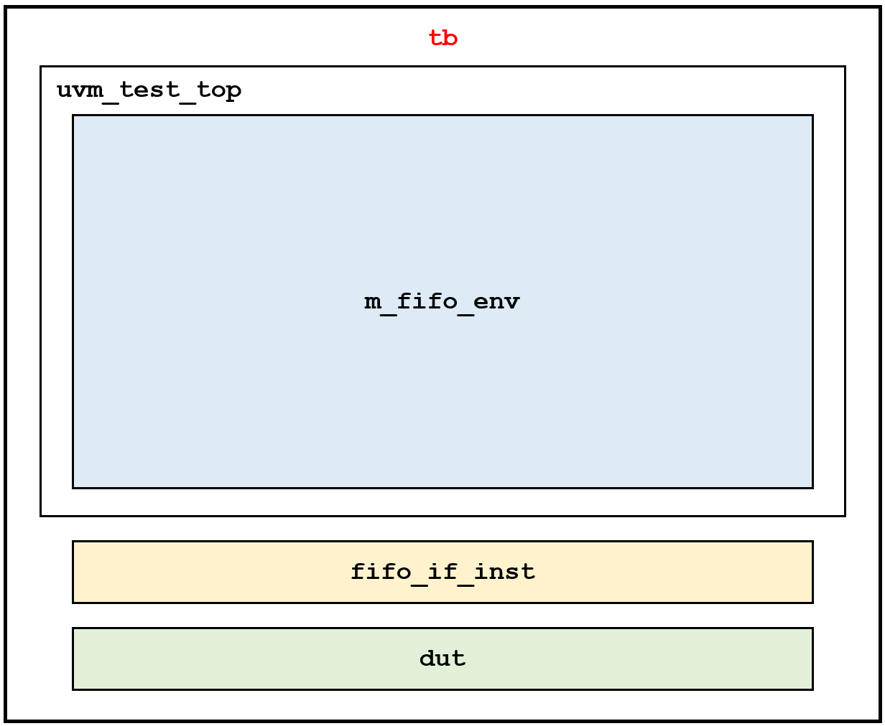
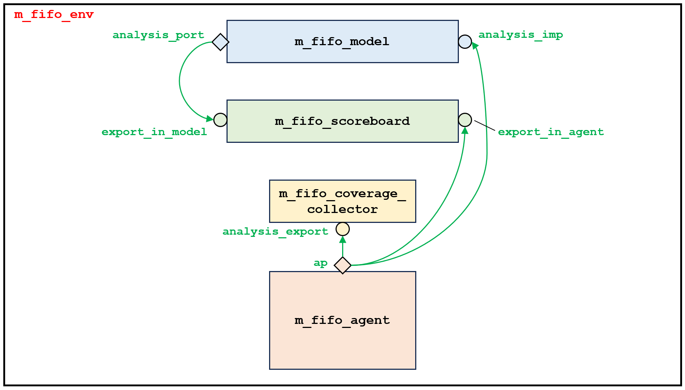
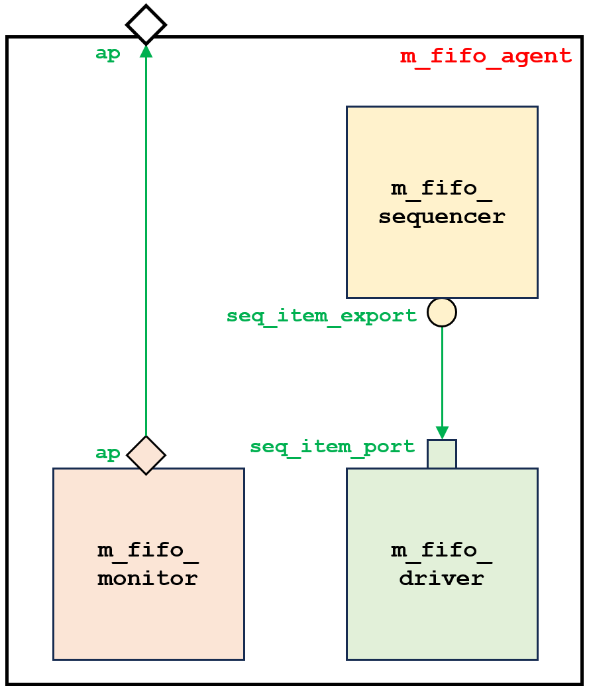
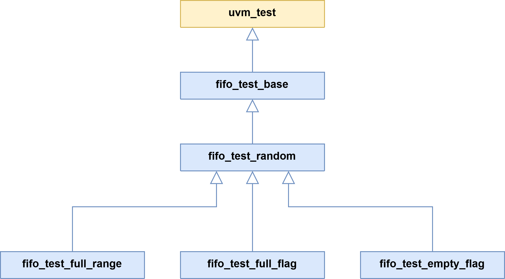

# Synchronous FIFO: UVM Verification
This **synchronous FIFO (First In First Out) buffer** has a size of $2^N$-word $×$ $M$-bit (depth $×$ width).

**Interface Signals**:
* **clk**:      System clock
* **reset_n**:  Active-low synchronous reset
* **re**:       Read enable control signal 
* **we**:       Write enable control signal
* **wd**:       Write data input ($M$ bits)
* **rd**:       Read data output ($M$ bits)
* **full**:     "FIFO is full" status flag
* **empty**:    "FIFO is empty" status flag

**Important internal registers**:
* **w_ptr** (write pointer): Tracks the address for the next write operation
* **r_ptr** (read pointer): Tracks the address for the next read operation

In this project, the FIFO is designed, modeled, and verified using the **SystemVerilog HDVL** and the **Universal Verification Methodology (UVM)**.

The following figures show the **structure of the UVM testbench**.

The following figure shows **UML class diagrams of the UVM tests** used to verify the DUT.

